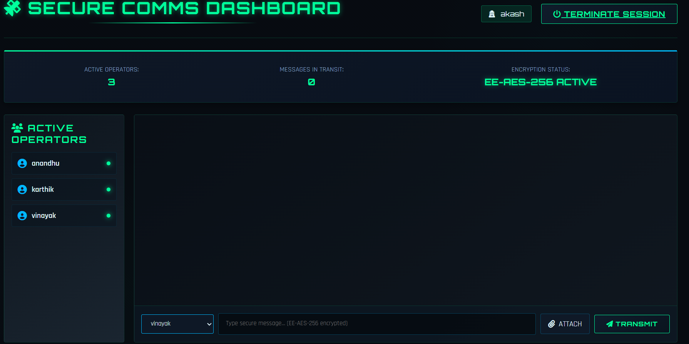
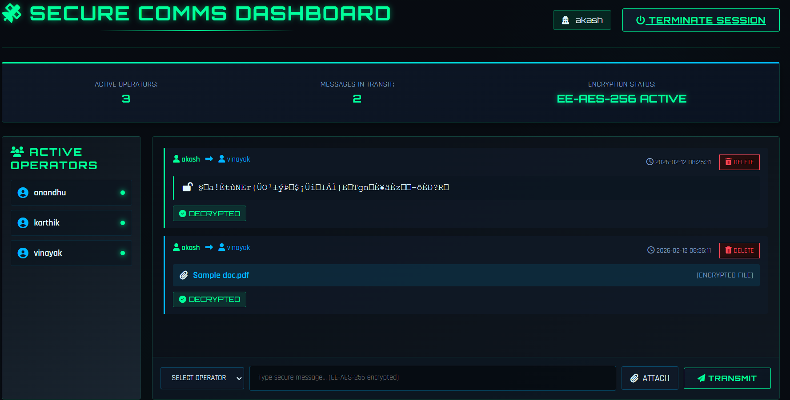
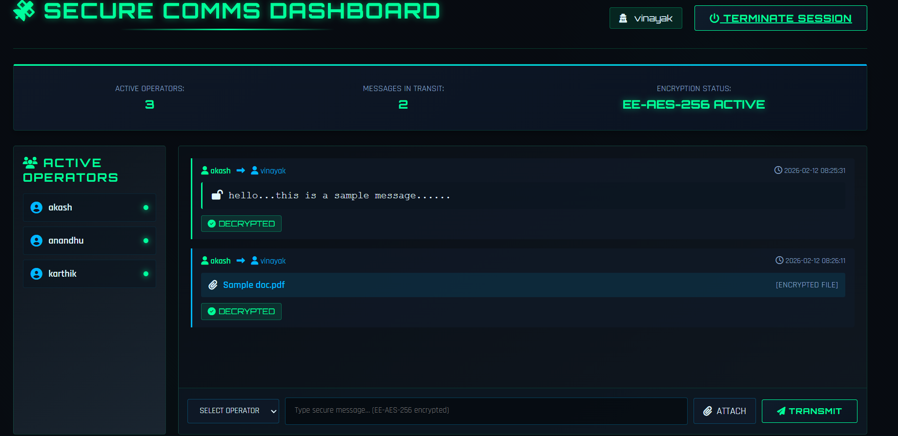

# COMMSEC-ONE (Secure File Encryption System – Academic Project)

## Overview
COMMSEC-ONE is an academic secure file encryption system developed as
part of a final-year B.Tech Computer Science and Engineering project.

The system demonstrates encryption and decryption of files using a
modified AES-based approach (EE-AES) for educational purposes.

## Features
- File encryption and decryption
- AES-based security (EE-AES)
- Dynamic S-Box concept
- Flask-based web interface

## Technology Stack
- Python
- Flask
- Cryptography concepts (AES)
- HTML, CSS

## Academic Context
This project is intended strictly for academic and learning purposes.
It is not a commercial or military-grade product.

## 📸 Application Screenshots

### 🔐 Secure Login

### 📝 Secure Signup

### 📊 Dashboard

### 🛂 Access Control

### 🔒 Encryption Result

### 🔓 Decryption Result

> Additional screenshots are available in the `screenshots` folder.

## Author
Akash A S  
B.Tech Computer Science & Engineering
